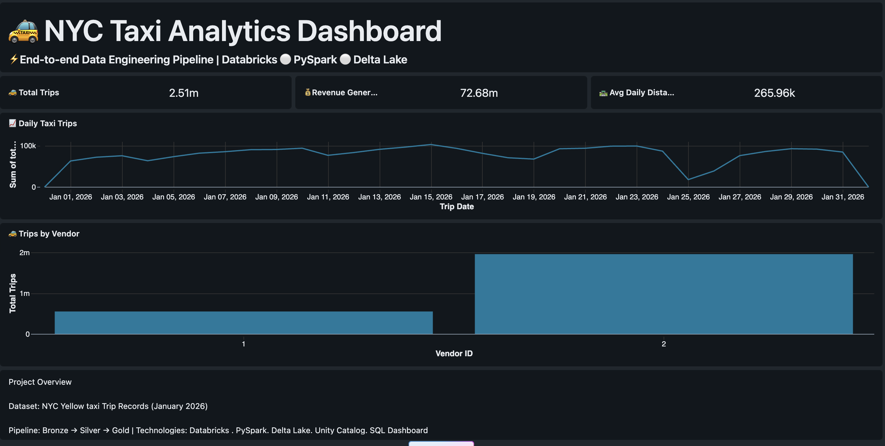
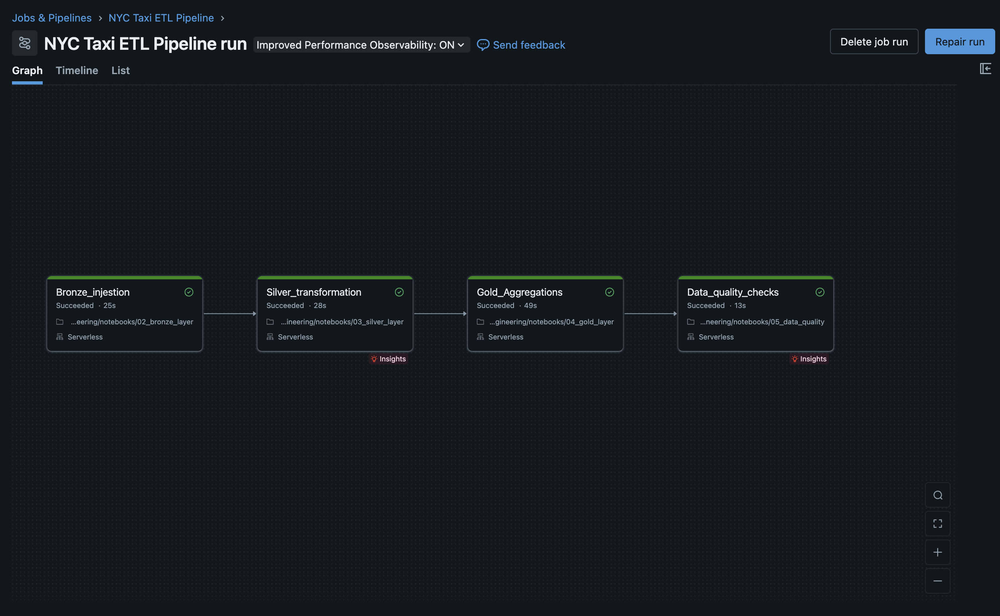
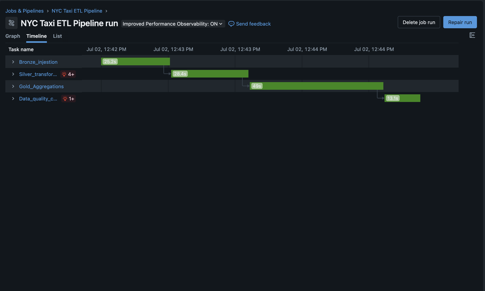
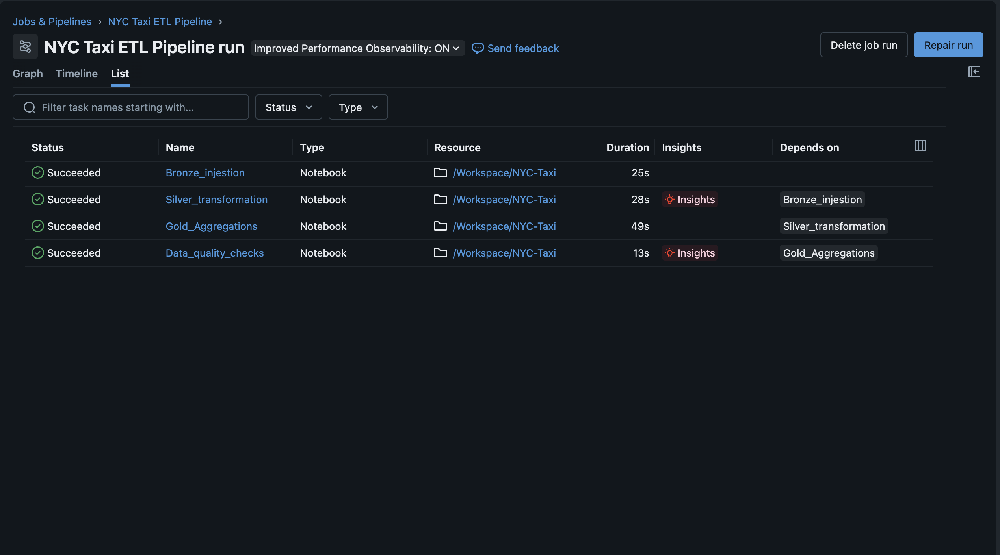
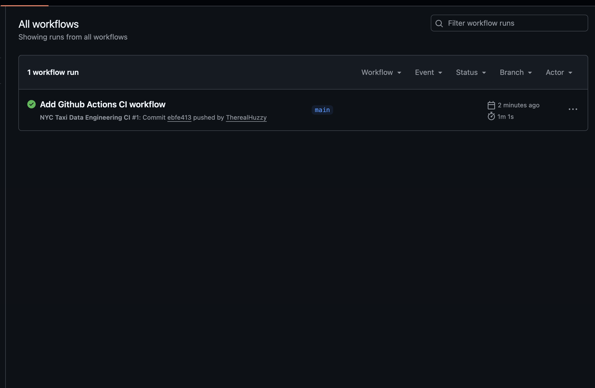

# 🚖 NYC Taxi Data Engineering Pipeline

## 📖 Overview

This project demonstrates the design and implementation of a modern end-to-end Data Engineering pipeline using Databricks, PySpark, Delta Lake, and GitHub.

The pipeline processes the NYC Yellow Taxi Trip dataset using the Medallion Architecture (Bronze → Silver → Gold), automates data processing with Databricks Workflows, validates data quality, visualizes business insights through an interactive dashboard, and implements Continuous Integration (CI) using GitHub Actions.

The objective of this project is to showcase production-oriented data engineering practices including ETL development, workflow orchestration, data quality validation, version control, and CI/CD.

---

# 🎯 Project Objectives

- Build an end-to-end ETL pipeline using Databricks
- Implement Medallion Architecture
- Store data using Delta Lake
- Perform data cleaning and validation
- Create business-ready analytical datasets
- Build an interactive Databricks SQL Dashboard
- Automate pipeline execution using Databricks Workflows
- Implement automated data quality monitoring
- Version control using Git and GitHub
- Implement Continuous Integration using GitHub Actions

---

# 🏗️ Solution Architecture

The pipeline follows the Medallion Architecture pattern.

```
NYC Taxi Dataset
│
▼
01 Ingestion
│
▼
Bronze Layer
(Raw Delta Data)
│
▼
Silver Layer
(Cleaned & Validated Data)
│
▼
Gold Layer
(Business Aggregations)
│
▼
Data Quality Validation
│
▼
Databricks SQL Dashboard
│
▼
GitHub Repository
│
▼
GitHub Actions (CI)
```

---

# 📂 Dataset

Dataset:

NYC Yellow Taxi Trip Records

Source:

https://www.nyc.gov/site/tlc/about/tlc-trip-record-data.page

Data Used:

- January 2026
- Format: Parquet
- Size: 64.2 MB

---

# ⚙️ Technologies Used

| Technology | Purpose |
|------------|---------|
| Databricks | Data Engineering Platform |
| Apache Spark (PySpark) | Distributed Data Processing |
| Delta Lake | Storage Layer |
| Databricks SQL | Analytics & Dashboard |
| Unity Catalog | Data Governance |
| Git | Version Control |
| GitHub | Repository Management |
| GitHub Actions | Continuous Integration |
| Python | Data Engineering |
| SQL | Data Analysis |

---

# 📁 Project Structure

```text
nyc-taxi-data-engineering/

├── .github/
│ └── workflows/
│ └── ci.yml
│
├── config/
├── data/
│ ├── bronze/
│ ├── silver/
│ └── gold/
│
├── docs/
│ ├── architecture.png
│ └── dashboard.png
│
├── notebooks/
│ ├── 01_ingestion
│ ├── 02_bronze_layer
│ ├── 03_silver_layer
│ ├── 04_gold_layer
│ └── 05_data_quality
│
├── resources/
├── scripts/
├── src/
│ ├── ingestion/
│ ├── transformations/
│ ├── validation/
│ └── utils/
│
├── tests/
│
├── README.md
├── requirements.txt
└── .gitignore
```

---

# 🥉 Bronze Layer

The Bronze layer stores the raw NYC Taxi trip records in Delta format with minimal transformation.

### Responsibilities

- Raw data ingestion
- Schema preservation
- Delta conversion
- Historical data retention

---

# 🥈 Silver Layer

The Silver layer cleans and validates the Bronze data.

### Transformations

- Removed duplicate records
- Handled missing values
- Standardized timestamps
- Applied business validation rules
- Improved overall data quality

---

# 🥇 Gold Layer

The Gold layer creates business-ready analytical tables.

Generated datasets include:

- Daily Summary
- Hourly Summary
- Payment Summary
- Pickup Summary
- Vendor Summary

These tables power the reporting dashboard.

---

# 🛡️ Data Quality Monitoring

Automated validation checks ensure reliable data reaches downstream consumers.

Implemented checks include:

- Duplicate detection
- Null value validation
- Negative fare validation
- Negative trip distance validation
- Record count verification
- Business rule validation

If any validation fails, the pipeline stops and reports the error.

---

# 🔄 Workflow Orchestration

The ETL pipeline is orchestrated using Databricks Workflows.

Pipeline execution order:

```
01_ingestion
↓
02_bronze_layer
↓
03_silver_layer
↓
04_gold_layer
↓
05_data_quality
```

The workflow executes automatically according to the configured schedule.

---

# 📊 Dashboard


The Databricks SQL Dashboard provides business insights including:

- Total Trips
- Total Revenue
- Average Trip Distance
- Vendor Performance
- Daily Trip Trends
- Payment Distribution

---

# 🔍 Monitoring

Pipeline execution is monitored using Databricks Workflows.

Monitoring includes:

- Job status
- Task execution history
- Runtime duration
- Failure logs
- Successful pipeline runs

---

# 🚀 Continuous Integration (CI)

GitHub Actions automatically validates the repository on every push and pull request.

The workflow performs the following checks:

- Repository structure validation
- Dependency installation
- Python syntax verification
- Build validation

This ensures project quality before changes are merged.

---

# 💼 Skills Demonstrated

This project demonstrates practical experience with:

- Data Engineering
- ETL Development
- PySpark
- Delta Lake
- Databricks
- Medallion Architecture
- SQL
- Data Quality Monitoring
- Workflow Automation
- Dashboard Development
- Git
- GitHub
- GitHub Actions
- CI/CD
- Version Control

---

# 🔮 Future Improvements

Potential enhancements include:

- Real-time streaming ingestion
- Incremental data loading
- Automated deployment to Databricks using Databricks Asset Bundles
- Unit testing with PyTest
- Data quality framework integration (e.g., Great Expectations)
- Automated notifications on workflow failures

---

# 📸 Project Screenshots

## Dashboard



---

## Databricks Workflow







---

## GitHub Actions



---

# ⭐ Acknowledgements

Dataset provided by the New York City Taxi & Limousine Commission (TLC).

https://www.nyc.gov/site/tlc/about/tlc-trip-record-data.page